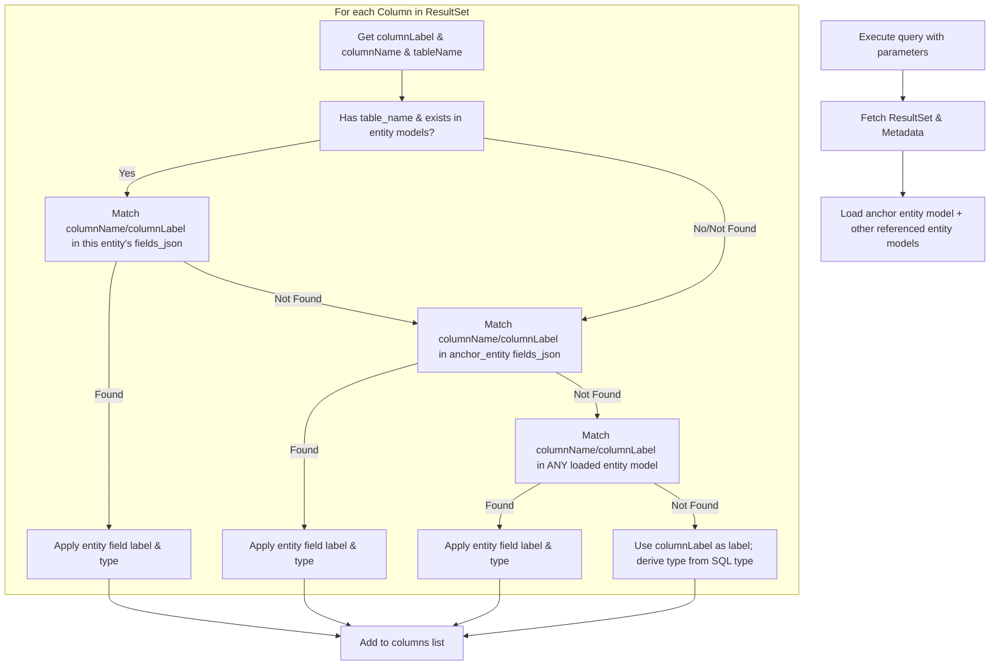

# Specification: Dynamic Runtime Schema Inference and Fallback

**Date:** 2026-06-19  
**Topic:** Dynamic SQL Schema Inference and Column Label Fallbacks  
**Status:** In Progress (Spec proposed for approval)  

---

## 1. Goal

Implement runtime SQL column deduction for the business page generator:
* Execute arbitrary SQL queries containing aliases, joins, or aggregations.
* Dynamically retrieve columns, their data types, and source tables using JDBC `ResultSetMetaData`.
* Resolve semantic display labels, formatting, and types by matching column metadata against `lc_entity_model.fields_json`.
* **Fallback Rule:** If an alias or column name cannot be mapped to any entity model field, display the alias/column label exactly as it is returned by the SQL query.

---

## 2. API Response Schema Change

To support dynamic columns, the endpoint `POST /api/v1/queries/{queryCode}/execute` will be updated from returning a flat list of rows (`List<Map<String, Object>>`) to a structured query result object:

```json
{
  "columns": [
    {
      "field": "user_name",
      "label": "用户名",
      "type": "string"
    },
    {
      "field": "total_sales",
      "label": "total_sales",
      "type": "number"
    }
  ],
  "rows": [
    {
      "user_name": "Alice",
      "total_sales": 1500.00
    }
  ]
}
```

### Column Schema Model (Java / JSON)
* `field`: The key in the row object (mapped from `ResultSetMetaData.getColumnLabel(i)`).
* `label`: The user-friendly display name. Resolved from entity model field label, falling back to the `field` string itself if not found.
* `type`: The frontend-friendly type representation (`string`, `integer`, `number`, `datetime`, `boolean`).

---

## 3. Runtime Resolution Pipeline (Backend)



### Type Mapping rules from SQL Types (`java.sql.Types`):
* `VARCHAR`, `CHAR`, `LONGVARCHAR` -> `string`
* `INTEGER`, `BIGINT`, `SMALLINT`, `TINYINT` -> `integer`
* `DECIMAL`, `DOUBLE`, `FLOAT`, `NUMERIC`, `REAL` -> `number`
* `DATE`, `TIMESTAMP`, `TIME` -> `datetime`
* `BOOLEAN`, `BIT` -> `boolean`
* Others -> `string`

---

## 4. Frontend Dynamic Table Rendering

1. **API Integration**: React component `PageLoader` will invoke `POST /api/v1/queries/{queryCode}/execute`.
2. **Column Registration**: Rather than using a static columns config from `lc_page_model`, the table columns are driven dynamically by the API's `columns` array.
3. **Table Display**: Render an interactive table using Tailwind design for rich aesthetics (dark accents, smooth hover states, striped rows).
4. **Fallback Handling**: If a column has no mapping, it is safely rendered using its field key (the SQL alias).
